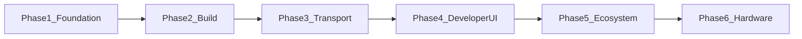

## Overview

NextGenMediaTransport (NGMT) is a high-performance, open-source media transport protocol positioned to compete with NDI. It is a modernized fork of Open Media Transport (OMT), focused on **developer and operator experience**, **modern networks**, and **permissive licensing** so hardware and software vendors can adopt it without friction.

### Strategic pillars

- **QUIC-based transport** — WAN and remote production paths (NAT traversal, lossy links) as first-class, not an afterthought. Implemented in **NGMT** (`ngmt-transport`); upstream OMT today is LAN/TCP-based and provides no QUIC transport repository to fork.
- **AV1 / VMX codec support** — Modern compression aligned with `ngmt-codec` and ecosystem goals.
- **Zero-configuration local discovery** — Sources appear automatically on the LAN (mDNS / Zeroconf), matching the best user-facing aspects of entrenched tools.

Competing with an entrenched standard requires more than cleaner code: NGMT must remove adoption friction (buildability, docs, integrations) and deliver **WAN credibility** alongside **LAN simplicity**.

## Phase index

Structured plans for each phase live in this directory:

- [Phase 1 — Foundation and Forking](./01-Phase-1-Foundation-and-Forking.md) — GitHub organization, essential forks, cross-platform CI/CD, MIT/Apache-2.0 licensing, documentation automation, and repository-wide agent rules.
- [Phase 2 — Refactor and Build Standardization](./02-Phase-2-Refactor-and-Build-Standardization.md) — CMake/Cargo alignment, dependency pruning, coding standards, one-click local builds.
- [Phase 3 — Core Features: Discovery and WAN](./03-Phase-3-Core-Features-Discovery-and-WAN.md) — mDNS discovery, QUIC/NAT tuning, loss recovery, congestion control, and **network simulation** validation.
- [Phase 4 — Developer UI and Visibility](./04-Phase-4-Developer-UI-and-Visibility.md) — Studio Monitor–class tools: test pattern sender, single/multiview receivers, discovery browser, and related debug UIs.
- [Phase 5 — Integrations and Ecosystem](./05-Phase-5-Integrations-and-Ecosystem.md) — OBS Studio plugin, virtual camera/audio, SDK wrappers (Python, C++, Rust).
- [Phase 6 — Hardware and Commercial Adoption](./06-Phase-6-Hardware-and-Commercial-Adoption.md) — Reference hardware (e.g. Raspberry Pi 5 encoder), PTZ/tally schemas, commercial outreach.

## Documentation governance

Documentation must scale with the codebase. **Humans:** treat `docs/project-plan/` as the strategic source of truth for phases and priorities. **Agents and automation:** **`.cursor/rules/`** (for example always-applied [`documentation.mdc`](../../.cursor/rules/documentation.mdc)) mandates autonomous updates to documentation (API references, architecture notes, changelogs, integration guides) whenever code changes—so the rule applies even when work happens deep in a single crate or submodule. Phase 1 also describes **CI-driven documentation pipelines** (e.g. GitHub Actions) to generate or refresh artifacts on merge; ongoing edits remain a standing obligation, not a one-time setup.

## Phase dependencies

Work is sequential in intent: **Phase 2** assumes **Phase 1** repos, CI, and licensing; **Phase 3** assumes a clean, standardized build from **Phase 2**; **Phase 4** (developer UI) assumes **Phase 3** protocol and transport stability; **Phase 5** and **Phase 6** build on a stable protocol story and benefit from first-party debug tooling from Phase 4. Parallel work is possible only where interfaces are stable and documented.

## Roadmap at a glance

