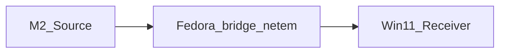

# NGMT network impairment harness setup

This document describes **reproducible** WAN/WLAN simulation for NextGenMediaTransport (NGMT) validation across **Fedora 43**, **macOS (M2)**, and **Windows 11**.

To **build** Generator/Monitor on Fedora first (Rust, GTK, XCB, ALSA, CMake), see [**Linux (Fedora) build guide**](../build/linux-fedora.md).

For **copy-paste log capture** (paths under `target/<profile>/logs/`, Mac + Fedora), see [**Lab log capture**](lab-log-capture.md).

## Lab roles (reference)

| Machine | Typical role |
|---------|----------------|
| **Fedora 43** | `tc` / `netem` on `wlan0` (or bridge) |
| **M2 Pro Mac** | Source + `dnctl` / `pf` impairment on `en0` |
| **Windows 11** | Receiver + **Clumsy 0.3** on Wi-Fi adapter |

Adjust interface names (`wlan0`, `en0`, etc.) to match `ip link` / System Settings.

## Studio apps — capture trace to a file (audit / “where it died”)

**`ngmt-generator`** and **`ngmt-monitor`** emit the same lines to **stderr** and, when a file sink is active, append each line (create/append, flushed). Format: **`YYYY-MM-DDTHH:MM:SS.mmmZ [app] component | detail`** (UTC wall clock, millisecond precision — sortable and readable; not raw Unix epoch ms). Use this for **2% / 5% / 10%** loss runs so logs survive terminal scrollback and you can attach them to [`impairment-results.md`](impairment-results.md).

**Enable file mirroring:** set **`NGMT_LOG_FILE`** before launch **or** use the in-app **File trace** / **Mirror trace to disk** panel (**Apply** picks a path at runtime; **`NGMT_LOG_FILE`** is still read once at startup if the UI has not opened a file yet). See [Lab log capture](lab-log-capture.md).

**Extra Studio trace env (optional):**

| Variable | Effect |
|----------|--------|
| **`NGMT_LOG_ID=1`** (or `true` / `yes`) | Prepends `[host=… pid=…]` to every trace **detail** (after the first `session` line) so merged logs stay attributable per process. |
| **`NGMT_LOG_METRICS_INTERVAL_SECS=N`** | If `N > 0`, Monitor recv loop and Generator send loop emit periodic **`metrics`** lines (RTT, OWD EMA, FPS, cwnd, loss, … / encoded bytes, subscribers, …). Default is **off** (unset or `0`); default **`worker`** / **`slot_worker`** heartbeats still log compact FPS and frame ids (see [lab-log-capture.md](lab-log-capture.md)). |

In **Generator** / **Monitor**, **Save log as…** and **Open log…** under **File trace** use an **in-app file browser** (still set **`NGMT_LOG_FILE`** if you prefer env-only capture).

On the **first** `emit_studio_trace` call in each process, a single **`session`** line is always written (`host`, `pid`, `profile=debug|release`) before the app’s normal traces.

**Same machine, both apps:** use **two different paths** — one for Generator, one for Monitor. Reusing the **same path for both processes** interleaves lines from two writers and makes post-mortems painful. Typical names: `…/ngmt-generator-<scenario>.log` and `…/ngmt-monitor-<scenario>.log`.

**Same machine — two terminals (recommended):**

```bash
# Terminal A — generator only
export NGMT_LOG_FILE=/tmp/ngmt-generator-loss5.log
cargo run --release --bin ngmt-generator
```

```bash
# Terminal B — monitor only
export NGMT_LOG_FILE=/tmp/ngmt-monitor-loss5.log
cargo run --release --bin ngmt-monitor
```

Set the variable **in that shell** before launching the binary. On a second platform class (e.g. x86 Linux vs Apple ARM), repeat with the same profile and note **all four** log paths in the results row when you compare platforms (two paths per machine × two machines).

## Fedora 43 — `tc` / `netem`

Requires root. Replace `$IFACE` (e.g. `wlan0`).

**Add** impairment (example: 5% loss + 100 ms delay):

```bash
sudo tc qdisc add dev "$IFACE" root netem loss 5% delay 100ms
```

**Remove** (cleanup):

```bash
sudo tc qdisc del dev "$IFACE" root
```

**Transparent bridge (optional):** Mac → Fedora (bridge) → Win11 with `netem` on the bridge-facing interface. Use a small mermaid sketch in your lab notes:



## Windows 11 — Clumsy 0.3

1. Run Clumsy as Administrator.
2. Select the **wireless** or test adapter.
3. Enable filters for **drop** (%) and **delay** / **throttle** as needed.
4. Start; measure NGMT while filter is active.

## macOS (M2) — `dnctl` / `pf`

Apple’s dummynet (`dnctl`) + `pfctl` can shape traffic on a specific interface (e.g. `en0`). Exact commands vary by OS version; prefer **Network Link Conditioner** (GUI) for quick profiles, or documented `dnctl pipe` + `pf` rules for CLI reproducibility. Record the exact command sequence in your runbook when you stabilize it.

## Related

- [`wlan-simulation.md`](wlan-simulation.md) — baseline vs impaired methodology on WLAN.
- [`impairment-results.md`](impairment-results.md) — append-only log of lab runs (metrics, SHAs, tools).
- [`../../tools/simulate_impairment.sh`](../../tools/simulate_impairment.sh) — Linux helper script (repo root `tools/`).
